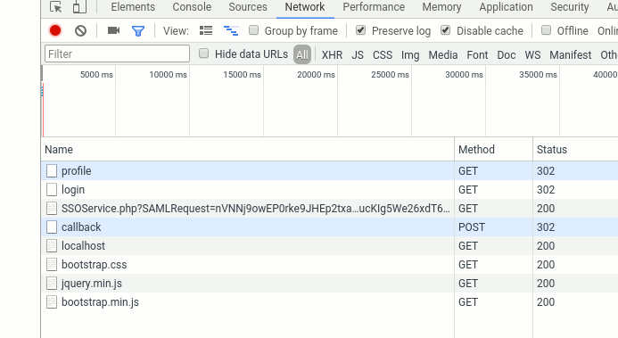

Task for Applicants
===================

Right now thsi repository can simply be cloned and after following the steps from readme, you can start the app and log in. Credentials are provided to applicants seperately.

Right now this node app is using in-memory session store, hence when the node service is restarted, fetching [http://localhost:3000/profile](http://localhost:3000/profile) is causing a new SAML login. This can easily be watched in developer tools network console after setting preserve log option:

The task is to replace the in-memory session store with a persistant store, so that the session is still available after restarting the node app. Since we already use PostgreSQL this would be the preferred option.

What to  do?
------------

Fork this repository, implement a persistant session store and send a pull request.
